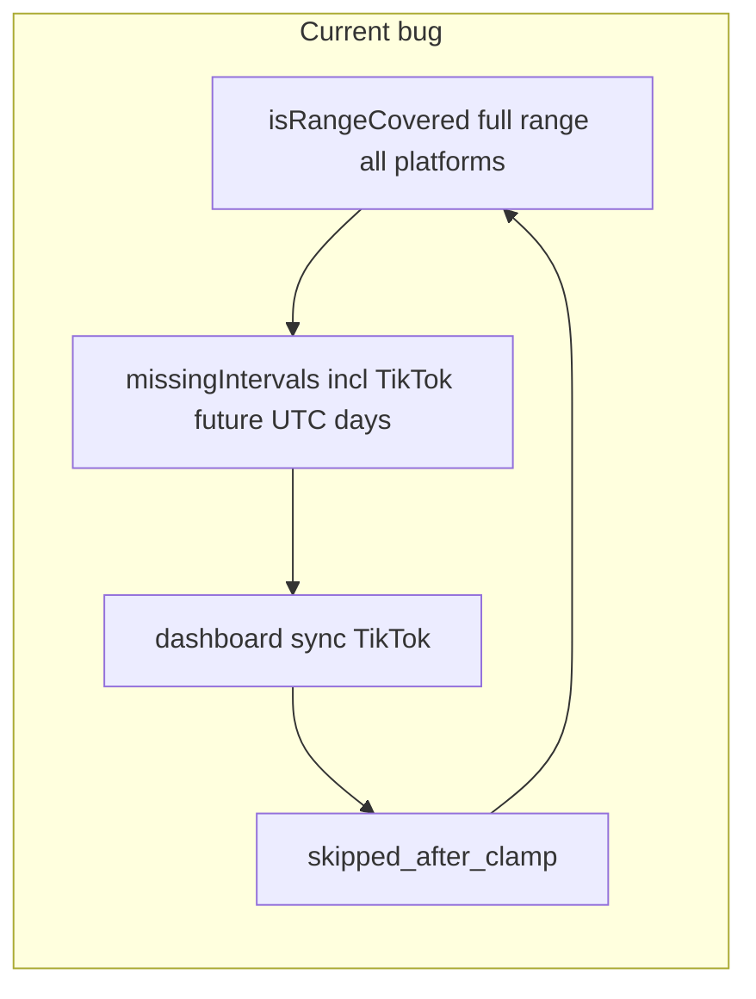

# TikTok historical backfill vs UTC yesterday clamp

## Подтверждение root cause (код)

**1. TikTok `effective_end` и skip**

В [`app/api/oauth/tiktok/insights/sync/route.ts`](app/api/oauth/tiktok/insights/sync/route.ts) (около 361–397):

- `yesterday` = календарный **вчера в UTC** (`setUTCDate(..., -1)` + `toISOString().slice(0, 10)`).
- `until = min(requestedUntil, yesterday)` — запрос никогда не уходит «дальше вчера» по UTC.
- Если после clamp `since > until` → `skipped_after_clamp` с `reason: "no_data_for_today_after_clamp"` (название историческое: по смыслу это **max report date = UTC yesterday**).

Отсюда при «сегодня UTC = 2026-04-03» и запросе 2026-04-03–2026-04-04: `effective_end = 2026-04-02`, `since = 2026-04-03` → полный skip. **Это не Asia/Aqtau и не off-by-one в другой TZ** — в этой ветке используется только UTC.

### UTC-yesterday clamp: намерение продукта/кода, не временный костыль

- В коде нет пометки «TODO / hack»; логика стабильна: верхняя граница отчётного дня для TikTok — **календарное вчера UTC**, с явным skip и логом `no_data_for_today_after_clamp` (историческое имя поля).
- Семантика соответствует типичному контракту маркетинговых API: «сегодня» по UTC часто неполно/недоступно; **до явного изменения требований продукта** clamp считаем **осознанным контрактом синхронизации**, который нужно отражать и в coverage, и в freshness/status (см. ниже).
- При реализации допустима одна строка JSDoc в helper/route, фиксирующая этот контракт.

**2. Historical coverage**

В [`app/lib/dashboardBackfill.ts`](app/lib/dashboardBackfill.ts) функция `isRangeCovered`:

- Строит `allDates = datesInRange(start, end)` для **всех** аккаунтов одинаково.
- `covered` по аккаунту: есть ли строка на **каждый** день из `allDates`.
- Пересечение «все аккаунты покрыли день d» — для каждого `d` в полном `[start, end]`.

TikTok физически не может заполнить 2026-04-03/04, пока по правилам sync это «после вчера UTC», но backfill всё равно считает эти дни обязательными → `missingIntervals` → `ensureBackfill` → POST [`/api/dashboard/sync`](app/api/dashboard/sync/route.ts) → снова TikTok skip → цикл.

**3. Баннер**

В [`app/app/AppDashboardClient.tsx`](app/app/AppDashboardClient.tsx) (около 1157–1194, 2282–2308): баннер «Подгружаем исторические данные» включается, если в ответе summary/timeseries есть `backfill.historical_sync_started` или `backfill.range_partially_covered`. Метаданные выставляет [`applyBackfillMetadata`](app/lib/dashboardBackfill.ts) при `reason === "historical"` и ненулевых `historicalSyncIntervals`. Пока `ensureBackfill` каждый раз видит «дыру», баннер снова поднимается после poll. После фикса coverage метаданные перестанут выставляться при единственной «дыре» в недоступном TikTok-хвосте → `clearBackfillPolling` сбросит баннер (подробнее — раздел «Доказательство» ниже).

---

## Минимальный фикс (рекомендуемый)

### A. Один источник правды для «макс. дня TikTok»

- Добавить небольшой модуль, например [`app/lib/tiktokReportDateBounds.ts`](app/lib/tiktokReportDateBounds.ts), с функцией вида `tiktokMaxInclusiveReportDateUtcYmd(now?: Date): string` — **та же формула**, что сейчас в TikTok sync (вчера UTC).
- В [`app/api/oauth/tiktok/insights/sync/route.ts`](app/api/oauth/tiktok/insights/sync/route.ts) заменить локальный расчёт на вызов helper (поведение **без изменений**, только DRY).

### B. `isRangeCovered`: required dates per platform

Файл: [`app/lib/dashboardBackfill.ts`](app/lib/dashboardBackfill.ts).

1. Одним запросом загрузить `ad_accounts` для переданных `ids`: как минимум `id`, `platform` (поле уже есть, см. [`dashboard/sync`](app/api/dashboard/sync/route.ts) `select("id, external_account_id, provider")`).
2. Для каждого аккаунта ввести множество **обязательных** дат:
   - `tiktok`: `datesInRange(start, min(end, tiktokMaxInclusiveReportDateUtcYmd()))`; если `min < start` → пустое множество (аккаунт «не обязан» покрывать дни вне окна).
   - `meta` / `google` / прочее: как сейчас, `datesInRange(start, end)`.
3. Пересчитать:
   - **per-account `covered`**: все дни из **required** множества присутствуют в `datesByAccount`.
   - **`uncoveredAccountIds`**: как сейчас, от `covered`.
   - **пересечение по дням** (`coveredByAll`): для каждого `d` из `datesInRange(start, end)` день считается покрытым всеми, если для **каждого** аккаунта `a`: либо `d` не входит в required(a), либо у `a` есть строка за `d`.
4. `missingIntervals(start, end, coveredByAll)` оставить как есть — он уже работает от множества покрытых дней в пользовательском диапазоне.

Итог: дни строго после TikTok max перестают требовать строки TikTok; Meta/Google по-прежнему должны покрывать весь выбранный интервал. Бесконечные триггеры и баннер уходят без изменения контракта API и без рефакторинга sync pipeline.

### C. (Обязательно) Integration status / freshness TikTok

Без этого после исчезновения баннера платформа может оставаться `stale` / `data_behind`: UI сравнивает `data_max_date` с **UTC today**, тогда как по контракту синка TikTok **максимально ожидаемый** отчётный день — **UTC yesterday** (тот же helper, что в sync).

Файл: [`app/api/oauth/integration/status/route.ts`](app/api/oauth/integration/status/route.ts).

- Для `platform === "tiktok"`: при проверке «догнали ли доступный хвост» использовать эталон `tiktokMaxInclusiveReportDateUtcYmd()` вместо «сегодня» (например опциональный аргумент `dataFreshnessThroughYmd` в `resolveDataStatus`, подставлять только для TikTok).
- Остальные платформы — без изменения семантики.

---

## Доказательство: после исчезновения `historicalSyncIntervals` UI сбрасывает баннер и polling

Цепочка в [`app/app/AppDashboardClient.tsx`](app/app/AppDashboardClient.tsx):

1. **Метаданные с сервера:** `applyBackfillMetadata` выставляет `historical_sync_started` / `range_partially_covered` и `historicalSyncIntervals` только при `reason === "historical"` и **ненулевых** `historicalSyncIntervals`. Если coverage-фикс убирает «дыру», `ensureBackfill` перестаёт отдавать historical с интервалами → в JSON summary/timeseries поле `backfill` отсутствует или без этих флагов/интервалов.

2. **`hasHistoricalBackfill`:** после парсинга bundle в `loadFromDb`, флаг `true` только если у summary или timeseries есть `backfill.historical_sync_started` или `backfill.range_partially_covered`. Иначе — `false`.

3. **Сброс state и таймера:** при `hasHistoricalBackfill === false` выполняется ветка `else` с `clearBackfillPolling`: снимается `window.setTimeout` по ref, сбрасывается счётчик попыток, `setHistoricalBackfill(null)` — баннер и локальный backfill-state очищаются.

4. **Защита от «залипания» и от перезаписи более новым ответом:** в начале успешного пути (сразу после KPI) стоит `if (mySeq !== reqSeqRef.current) return false` — **до** `setSummary` / `setPoints` / блока backfill ([`AppDashboardClient.tsx`](app/app/AppDashboardClient.tsx) ~1123). Новый `loadFromDb` в начале делает `++reqSeqRef.current`, поэтому любой ответ, у которого `mySeq` меньше текущего, **не доходит** до `setHistoricalBackfill` / `clearBackfillPolling`. Между этим guard и блоком backfill (~1157–1195) **нет `await`**, т.е. обработка одного ответа от границы до backfill идёт синхронно — другой completion не вклинивается и не может «перепрыгнуть» guard. Второй guard ~1204 отсекает устаревший ответ для последующих побочных эффектов (auto-refresh и т.д.).

5. **Ошибки:** в `catch` вызывается `clearBackfillPolling()` — polling не залипает при сбое загрузки.

Итог: при отсутствии historical backfill-флагов в ответе **последнего** успешного запроса UI **должен** очищать баннер и polling; «залипание» возможно только если не приходит новый успешный ответ (кэш/сеть), а не из-за необнуляемого локального state после нормального `loadFromDb`.

---

## Что сознательно не делаем в минимальном scope

- Не менять ответ Paddle/TikTok API и не добавлять новый backend enum.
- Не переносить clamp в «таймзону рекламного кабинета», пока нет требования продукта (сейчас код явно UTC).
- Не крупный рефакторинг `ensureBackfill` / chunking.

---

## Проверка после фикса

1. Диапазон с данными Meta/Google до 2026-04-04, TikTok в БД до 2026-04-02, «сегодня» UTC 2026-04-03+: `ensureBackfill` не должен триггерить historical только из‑за 2026-04-03–04 для TikTok.
2. Баннер исчезает, когда ответ bundle/summary перестаёт отдавать `range_partially_covered` / `historical_sync_started` для этого сценария; `clearBackfillPolling` вызывается (см. раздел «Доказательство» выше).
3. После п.1–2 интеграция TikTok в `/api/oauth/integration/status` не остаётся ложно `stale`/`data_behind`, если `data_max_date` совпадает с максимально доступным днём по clamp (вчера UTC).
4. Регрессия: проект только TikTok, диапазон полностью внутри `[start, min(end,T)]` — логика покрытия как раньше.
