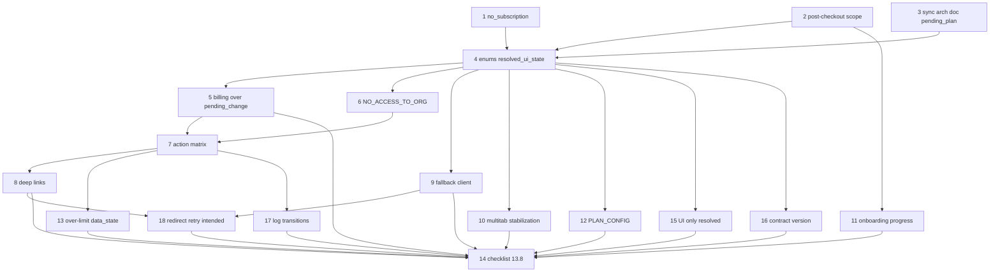

# План внедрения: Billing UX Hardening (BoardIQ)

Файл в формате **Cursor Plan**: YAML сверху (`name`, `overview`, **`todos`**) — отмечать прогресс там. Ниже сначала **что делать и в каком порядке**; детальные таблицы и копирайт — в разделе **«Спецификация»**.

**Код в этом файле не пишется.**

## Связанные артефакты

| Артефакт | Назначение |
| -------- | ---------- |
| **Cursor Plan (то же содержание todos)** | [.cursor/plans/billing_ux_hardening.plan.md](../.cursor/plans/billing_ux_hardening.plan.md) — открывать в UI Plans |
| Основной архдок BoardIQ | `boardiq_billing_subscription_lifecycle_64247266.plan.md` в `.cursor/plans/` — §28–§36, lifecycle, Screen Map |
| Этот файл | План работ + спецификация §1–§13 |

При изменении списка **`todos`** в YAML — синхронизировать с `.cursor/plans/billing_ux_hardening.plan.md` (или наоборот).

---

## 1. Контекст и проблема

- Несколько осей состояния (onboarding, invite, project, billing) без жёсткого приоритета на UI → конфликты экранов.
- Нет обязательного контракта `resolved_ui_state` / reason codes → фронт угадывает доступ.
- Runtime: ошибка bootstrap, multi-tab, скачки active/unpaid, webhook delay → баги только в проде.

## 2. Цель (outcome)

После выполнения плана: **один** ответ API определяет shell UI; биллинг не маскируется `pending_plan_change`; есть fallback при ошибке API; deep links и over-limit согласованы с матрицей действий; продуктовые политики `no_subscription` и post-checkout **зафиксированы письменно**.

## 3. Вне scope

- Смена биллинг-провайдера с Paddle.
- Реализация кода в теле этого документа (только задачи и критерии).

## 4. Критерии успеха (gates)

1. Bootstrap / current-plan (или агрегат) отдаёт **`resolved_ui_state`** и enum-поля без свободных строк для `reason`.
2. Таблица **billing vs `pending_plan_change`** (спецификация §13.1) соблюдена в resolver на backend и в UI.
3. **`fallback_ui_state`** на клиенте: нет расширения прав при ошибке API.
4. Пройден чеклист **§13.8** (включая пункты §14); все **`todos`** в YAML — `completed` или `cancelled` с причиной.
5. Соблюдены **§14.1–§14.9** (контракт UI, `version`, логи, redirect/retry, гарантии).

## 5. Последовательность работ (execution order)

Выполнять по строкам; зависимости — в §6.

| № | Шаг | Доставка (output) | Todo `id` |
| - | --- | ----------------- | --------- |
| 1 | Утвердить production policy **`no_subscription`** | Запись решения (ADR/Notion); при demo — отдельные `reason`/`screen` | `product-signoff-no-subscription` |
| 2 | Утвердить scope **post-checkout** (payer, org/user, повторы) | Решение + поля API для завершения / прогресса | `product-signoff-post-checkout` |
| 3 | Синхронизировать основной архдок: **`pending_plan_change` в priority** | PR в архдок §2.3 / §28 (overlay vs fullscreen) | `sync-main-arch-pending-plan` |
| 4 | Ввести **enums + `resolved_ui_state`** в API | Контракт bootstrap; клиент только отображает | `api-enums-contract` |
| 5 | Resolver: **billing приоритетнее `pending_plan_change`** | Таблица §13.1 в коде + тесты | `billing-overrides-pending-change` |
| 6 | Разделить **`NO_ACCESS_TO_ORG`** vs нет проекта | Resolver + UI + action matrix | `resolver-no-access-to-org` |
| 7 | Согласовать **action matrix** с API gates | Единая матрица §4 + QA-кейсы | `action-matrix-align-gates` |
| 8 | Политика **deep links** + `intended_route` | Документ поведения + реализация по §5 | `routing-deep-links` |
| 9 | Клиент: **`fallback_ui_state`** | last_known + safe read-only default | `client-fallback-bootstrap` |
| 10 | Клиент: **multi-tab + stabilization** | §13.3–§13.5 | `runtime-multitab-stabilization` |
| 11 | Backend: **`onboarding_progress`** (шаги 1–3) | Персист + reload на тот же шаг | `onboarding-progress-backend` |
| 12 | **`PLAN_CONFIG` / feature matrix** с сервера | Один источник лимитов; UI не дублирует | `plan-config-enforcement` |
| 13 | **Over-limit + data_state** по виджетам | §6–§7 в продукте | `over-limit-and-data-ui` |
| 14 | Финальная **валидация §13.8** | Чеклист подписан / тикеты закрыты | `pre-impl-checklist-13-8` |
| 15 | **§14.1** — UI только по `resolved_ui_state` | Нет ветвлений по сырым осям; ревью/линт | `ui-no-raw-state-branching` |
| 16 | **§14.2** — поле **`version`** в контракте | API + проверка на клиенте; mismatch → fallback | `contract-resolved-ui-version` |
| 17 | **§14.3** — **`log_ui_state_transition`** | Пайплайн логов + retention | `log-ui-state-transitions` |
| 18 | **§14.4–14.7** — redirect cap, retry bootstrap, **`intended_route`** | Клиент по §14 | `redirect-retry-intended-route` |

## 6. Зависимости между шагами



## 7. Definition of Done (весь план)

- [ ] Выполнены строки 1–18 таблицы §5 или зафиксировано исключение.
- [ ] Все `todos` в начале файла — не `pending`.
- [ ] §13.8 выполнен; нет открытых блокеров по конфликту resolver.
- [ ] §14.1–§14.9 соблюдены в реализации.

---

# Спецификация

Ниже — **детальный материал** для продукт/дизайн/backend (таблицы, edge cases, копирайт), **§1–§13** и дополнение **§14**. Порядок реализации — **только по разделу «План внедрения»** выше.

---

## 1. Цель плана (сводка)

| Ожидание | Как этот документ помогает |
| -------- | --------------------------- |
| Нет конфликта состояний | Явный priority resolver дополнение к §28 основного документа + `pending_plan_change` (§2.3) |
| Синхронизация backend ↔ UI | Master contract + reason codes + action matrix (§3–§4) |
| Нет неоднозначностей | Политики «один вариант» где возможно (§2.1–§2.2); паттерны UI (§8) |
| Безопасная реализация | Routing/deep links (§5), non-owner (§9), edge cases (§10), приоритеты и риски (§11) |

---

## 2. Блок: нормализация состояний

### 2.1 Финализация `no_subscription`

**Проблема:** в основном документе перечислены варианты A/B/C (hard block, demo, read-only для legacy-сценариев). Для production нужна **одна** политика для **нового** пользователя без подписки.

**Решение (зафиксировать на ревью продукта):**

| Поле | Production policy (рекомендация плана) |
| ---- | ---------------------------------------- |
| **Выбранный вариант** | **Hard block** для боевых данных: после регистрации shell + paywall/оплата; без создания боевых проектов и без POST sync к реальным данным (согласовано с §0 основного документа). **Demo** — опционально как **отдельный** явный режим (статический/sandbox), не смешивать с «пустым дашбордом = метрики». |
| **Что видит** | Экран оплаты / onboarding к checkout; не «пустой дашборд с нулями». |
| **Что может** | Профиль аккаунта, выход, переход в Paddle checkout; политика «демо-контент» — только если включена отдельным флагом продукта. |
| **Что запрещено** | Создание боевых проектов, OAuth к боевым рекламным аккаунтам, sync/refresh, тяжёлые отчёты по реальным данным. |
| **Почему** | Минимизирует **ложные empty/zero** состояния и злоупотребление API; чёткая линия «нет оплаты → нет боевого тенанта». |

**Действия перед кодом:** утвердить на созвоне product + legal; если выбран **demo**, описать отдельный `reason` и отдельный `screen` в матрице §4.

---

### 2.2 Финализация post-checkout onboarding

**Проблема:** не зафиксировано, кто обязан проходить модалку и на каком уровне (user vs org).

**Решения (вынести на утверждение):**

| Вопрос | Плановая позиция |
| ------ | ---------------- |
| **Кто проходит** | **Только пользователь, который завершил checkout как payer** (billing_owner или тот, кто привязал подписку к org в вашем flow). **Invited user** — **не** полный трёхшаговый flow, если org уже оплачена; опционально **укороченный** welcome (без сбора company, если профиль org уже есть) — зафиксировать отдельным `reason`. |
| **Per user / per org** | **Per org для сбора company profile** (один раз на org после первой успешной оплаты); **per user** для флага «видел thank-you» если payer ≠ единственный будущий member — уточнить в схеме данных. Минимум: **идемпотентность по (org_id, flow_version)**. |
| **Повторный показ** | **Никогда** после успешного завершения, кроме админского сброса / новой org / явной миграции. Reload — возобновление **того же** шага, не новый цикл. |

**Действия:** добавить в спецификацию API поля: `post_checkout_completed_at`, scope org/user; согласовать с §26 основного документа.

---

### 2.3 `pending_plan_change_state` в priority resolver

**Проблема:** состояние описано в основном документе (§31), но **не входит** в жёсткий список §28.

**Решение:**

- **Место в priority** (предлагаемая вставка): **после** `paid_but_no_project` и **перед** применением «обычного» `access_state` для продуктовых действий **или** как **параллельный overlay** поверх `active` — выбрать одну модель:

| Модель | Описание |
| ------ | -------- |
| **A (рекомендуется)** | **Overlay** при `access_state === active` (или trialing) + `pending_plan_change === true`: не менять доминирующий `screen` с `dashboard` на отдельный route, а показывать **глобальный оверлей/баннер** + ограничить `allowed_actions` (§4). Priority §28 для **shell** не ломается: post-checkout и invite остаются выше. |
| **B** | Отдельный `screen: plan_change_pending` — полноэкранный аналог loading. Тогда вставить в §28 **после** пункта 4 и **перед** пунктом 5. |

- **Какие действия блокируются:** sync, создание сущностей, зависящих от **нового** лимита/плана; разрешить read, настройки, повтор bootstrap.
- **Длительность жизни:** до прихода консистентного `effective_plan` **или** таймаут **10–15 с** → fallback «Обновить статус» (как в §31 основного документа).

**Действия:** обновить **только** основной документ **отдельным PR** после утверждения этого плана (пункт чеклиста в §11), либо считать этот файл нормативным дополнением до merge.

---

## 3. Блок: Master state contract

### 3.1 `resolved_ui_state` — финальная структура

Расширение минимума из основного документа (§29):

```ts
resolved_ui_state = {
  screen: ScreenId,           // enum, см. §3.2
  reason: ReasonCode,         // enum, см. §3.2
  cta: CtaKey | null,        // enum ключей CTA для i18n
  allowed_actions: ActionId[],
  blocking_level: "hard" | "soft" | "none",
  version: string,             // §14.2; стартовое значение "v1"
  // опционально:
  pending_plan_change?: boolean,
  data_state_default?: "EMPTY" | "LIMITED" | "BLOCKED", // для виджетов по умолчанию
  intended_route?: string | null,                    // после разрешения shell
}
```

**Правило:** backend собирает объект **целиком**; UI **не** выводит `screen` из локальных эвристик. Запрет ветвлений по сырым осям на клиенте и проверка **`version`** — **§14.1**, **§14.2**.

---

### 3.2 Reason codes (обязательно, единый список)

**Запрет:** произвольные свободные строки в API для `reason` — только enum + версионирование при добавлении (`reason_version` опционально).

| ReasonCode | Когда |
| ---------- | ----- |
| `POST_CHECKOUT_REQUIRED` | Модалка post-checkout не завершена |
| `INVITE_PENDING` | Резолв приглашения |
| `INVITE_TIMEOUT` | Fallback после таймаута (§33 основного документа) |
| `NO_ACTIVE_PROJECT` | Нет доступного проекта |
| `PAID_NO_PROJECT` | Оплачено, нет проекта |
| `PLAN_CHANGE_PENDING` | Ожидание webhook после upgrade |
| `BILLING_NO_SUBSCRIPTION` | Нет подписки |
| `BILLING_UNPAID` | Unpaid после grace / политика |
| `BILLING_PAST_DUE` | Past due |
| `BILLING_GRACE` | Grace period |
| `BILLING_EXPIRED` | Истёк период |
| `BILLING_REFUNDED` | Refund / hard revoke |
| `OVER_LIMIT_PROJECTS` | Превышение проектов |
| `OVER_LIMIT_SEATS` | Превышение пользователей |
| `OVER_LIMIT_AD_ACCOUNTS` | Превышение рекламных аккаунтов |
| `BILLING_PORTAL_ERROR` | Ошибка открытия портала (опционально) |
| `PRORATION_PREVIEW_UNAVAILABLE` | Нет суммы для upgrade (§10.1) |
| `NO_ACCESS_TO_ORG` | Нет доступа к org (удалён из org, отозван доступ на уровне org) — §13.4 |

**ScreenId (пример enum):** `POST_CHECKOUT_MODAL`, `INVITE_LOADING`, `INVITE_FALLBACK`, `NO_PROJECT`, `NO_ACCESS`, `DASHBOARD`, `OVER_LIMIT_FULLSCREEN`, `PAYWALL`, `READ_ONLY_SHELL`, `SETTINGS`, `PRICING`, `LTV`, `REPORTS` — финализировать список = **все уникальные shell-режимы** из Screen Map основного документа (§35).

**ActionId:** см. §4.

---

## 4. Блок: Action matrix

Критично для реализации: **одна таблица** «состояние / экран → действия». Ниже — черновик для утверждения; ✓/✗ — разрешено ли действие в UI (API всё равно финально валидирует).

| Состояние (`reason` / режим) | `create_project` | `sync` / `refresh` | `export` | `billing_manage` | `navigate_app` | `navigate_settings` | `navigate_projects` |
| ---------------------------- | ---------------- | ------------------ | -------- | ---------------- | -------------- | ------------------- | ------------------- |
| `POST_CHECKOUT_REQUIRED` | ✗ | ✗ | ✗ | только если разрешено политикой модалки | только внутри шагов модалки | ограниченно | ✗ |
| `INVITE_PENDING` | ✗ | ✗ | ✗ | ✗ | ✗ | ✗ | ✗ |
| `PAID_NO_PROJECT` | ✓ | ✗ | ✗ | ✓ (owner) | ✓ (shell) | ✓ | ✗ |
| `NO_ACTIVE_PROJECT` | ✗* | ✗ | ✗ | ✓/✗ **зависит от роли** (owner может видеть биллинг org без проекта — уточнить) | ✓ | ✓ | ✓ |
| `PLAN_CHANGE_PENDING` | ✗ до confirm | ✗ | ✗ | read-only / retry | ✓ | ✓ | по политике |
| `BILLING_GRACE` / `PAST_DUE` | по лимитам | ~ (§5.1 основного документа) | ~ | ✓ owner | ✓ | ✓ | ✓ |
| `BILLING_UNPAID` / `EXPIRED` | ✗ | ✗ | ✗ | ✓ owner | ✓ read-only | ✓ | ✓ |
| `BILLING_NO_SUBSCRIPTION` | ✗ | ✗ | ✗ | ✓ (ведёт на оплату) | paywall | ограниченно | ✗ |
| `OVER_LIMIT_*` | ✗ до фикса | ✗ | ✗ | ✓ owner | ✗ (fullscreen block) | только разрешённые | ✗ |

\*Создание проекта при `NO_ACTIVE_PROJECT` — обычно ✗; исключения документировать.

**Действия перед кодом:** прогнать матрицу с backend-владельцем API и сверить с `requireBillingAccess` / project gates.

---

## 5. Блок: routing и deep links

**Проблема:** прямой заход на `/app/ltv`, `/app/reports`, `/app/settings` при конфликтующем shell-состоянии.

**План (единая политика):**

| Состояние | Поведение |
| --------- | ---------- |
| **Post-checkout** | **Redirect** на `/app` (или root shell) + **modal** поверх; **сохранять** `intended_route` в sessionStorage или в `resolved_ui_state.intended_route` после завершения — **редирект обратно** если маршрут разрешён. |
| **Unpaid / read-only** | Разрешить **заход** на URL только если экран в режиме read-only; **заблокированные** действия показывать inline; **не** silent redirect без сообщения. |
| **No project** | Deep link на отчёт/LTV → **redirect** на `NO_PROJECT` экран + баннер «Сначала создайте проект»; сохранить `intended_route`. |
| **Invite pending** | Любой deep link → **overlay/skeleton** тот же, что и для `/app`; после успеха — navigate к `intended_route` или dashboard. |

**Зафиксировать:** список маршрутов **public** vs **shell-gated**; единый helper «resolveNavigation» на клиенте **только по ответу API**, не по локальной логике.

---

## 6. Блок: over-limit детализация

Разделение по типам превышения (дополнение к §32 основного документа):

| Тип | Как исправить | Доступно до исправления | Блокируется |
| --- | ------------- | ------------------------ | ----------- |
| **Projects** | Архив/удаление проектов до лимита или upgrade | Просмотр списка проектов, переход в настройки, биллинг (owner) | Работа в «лишних» проектах, создание новых |
| **Users (seats)** | Удалить/деактивировать членов или upgrade | Owner: управление участниками | Приглашения, добавление seats |
| **Ad accounts** | Отключить лишние интеграции или upgrade | Список аккаунтов (read), настройки интеграций | Sync по лишним, подключение новых сверх лимита |

**Reason codes:** `OVER_LIMIT_PROJECTS`, `OVER_LIMIT_SEATS`, `OVER_LIMIT_AD_ACCOUNTS` — возможно **несколько** активных; UI показывает **объединённый** список нарушений.

---

## 7. Блок: Data state → UI паттерны

Таблица для виджетов (согласована с §30 основного документа):

| widget_type | EMPTY | LIMITED | BLOCKED |
| ----------- | ----- | ------- | ------- |
| **KPI cards** | «Нет данных за период» + CTA подключить/обновить | «Часть метрик по тарифу» + Upgrade | «Нет доступа» + причина (reason) |
| **Charts** | Empty state, ось времени видна | Blur/secondary series + подпись Limited | Placeholder lock + CTA оплаты/доступа |
| **LTV** | Onboarding данных | Cap по когортам/глубине + Upgrade | Lock screen |
| **Attribution** | Нет событий / нет связки | Часть отчётов (Growth pattern) | Lock |
| **Tables** | Пустая таблица с объяснением | Строки capped + «Показать в Growth» | Нет строк + баннер |

**Правило:** одинаковые компоненты **не** меняют layout без смены `data_state` — избегаем «прыгающего» UI.

---

## 8. Блок: UI система паттернов

Когда что использовать (снять ambiguity):

| Паттерн | Когда использовать | Примеры reason |
| ------- | ------------------ | -------------- |
| **Full screen** | Нет доступа к приложению целиком; over-limit block; критичный paywall | `OVER_LIMIT_*`, иногда `NO_SUBSCRIPTION` |
| **Modal blocking** | Обязательный подпоток без альтернативы выхода | `POST_CHECKOUT_REQUIRED` |
| **Banner (global)** | Софт-биллинг, grace, pending plan (если overlay лёгкий) | `BILLING_GRACE`, `PLAN_CHANGE_PENDING` |
| **Inline locked card** | Страница доступна, фича недоступна | LIMITED отчёты, часть attribution |

**Запрет:** использовать **modal blocking** для ошибок оплаты, которые должны закрываться — использовать dismissible modal + banner.

---

## 9. Блок: non-billing owner UX

**Сценарий:** org в `unpaid` / `past_due`, пользователь **не** billing_owner.

| Элемент | Содержание |
| ------- | ---------- |
| **Текст** | «Подписка организации неактивна. Оплату может продлить **владелец биллинга**.» |
| **CTA** | **«Связаться с владельцем»** (mailto/deep link / копировать email owner если разрешено политикой приватности) |
| **Не показывать** | Личный checkout как будто это его карта; кнопку «Оплатить» без пояснения |

**Reason:** отдельный подтип или флаг `payer_required: true` + `reason` остаётся `BILLING_UNPAID`.

---

## 10. Блок: billing edge cases

### 10.1 Proration preview fail

| Ситуация | UI | Блокировать upgrade? |
| -------- | --- | -------------------- |
| Paddle не вернул сумму / preview error | Сообщение **«Не удалось рассчитать доплату»** + retry + поддержка | **Да**, не пускать в checkout без суммы (safe default) |

**Reason:** `PRORATION_PREVIEW_UNAVAILABLE`.

---

### 10.2 Webhook delay

| Параметр | Значение |
| -------- | -------- |
| Сколько ждать | **10–15 с** UI timeout + фоновый poll bootstrap каждые N секунд (уточнить N) |
| Что показывать | `PLAN_CHANGE_PENDING` + «Обновляем тариф» + CTA обновить |

---

### 10.3 Billing cycle (future-proof)

| Сейчас | Будущее |
| ------ | ------- |
| Только **monthly** в продукте/копирайте | Поля API: `billing_interval`, `currency`; UI не хардкодить «/мес» без поля |
| Тесты | При добавлении annual — отдельный reason не нужен; обновить Screen Map pricing |

---

## 11. Финальный выход

### 11.1 Список дыр (gap list)

1. **Три варианта `no_subscription`** без выбранного production-варианта → §2.1  
2. **Post-checkout scope** (кто/когда/org vs user) не зафиксирован → §2.2  
3. **`pending_plan_change` вне priority** → §2.3  
4. **Нет единого enum** `reason` / `screen` / `actions` → §3  
5. **Нет action matrix** для QA и dev → §4  
6. **Deep links** при конфликтующих состояниях не описаны → §5  
7. **Over-limit** без разбиения по сущностям → §6  
8. **Виджеты** без единых паттернов EMPTY/LIMITED/BLOCKED → §7  
9. **Смешение** modal/banner/fullscreen → §8  
10. **Non-owner при unpaid** без отдельного копирайта → §9  
11. **Proration fail / webhook delay / interval** → §10  
12. **Billing vs `pending_plan_change`, API fallback, multi-tab, stabilization, onboarding persistence, enforcement** → §13  
13. **Контракт UI-only-resolved, versioning, логирование переходов, redirect/retry, intended_route, гарантии** → §14  
14. **`request_id`, dedup логов, client_safe_mode, расширенные логи, no silent downgrade** → §14.10–§14.14  

### 11.2 Решения

См. соответствующие §2–§10, **§13** (runtime / edge cases) и **§14** (контракт и диагностика).

### 11.3 Приоритет реализации (рекомендация)

| Приоритет | Что | Зависимости |
| --------- | --- | ----------- |
| **P0** | Reason codes + `resolved_ui_state` в API + клиент только рендер | Backend |
| **P0** | Priority resolver + `pending_plan_change` (overlay модель) | Backend + §2.3 sync с основным документом |
| **P1** | Action matrix + routing/deep links | P0 |
| **P1** | `no_subscription` policy + post-checkout policy | Product |
| **P2** | Over-limit детализация + fullscreen | P0 |
| **P2** | Data state таблица по виджетам | P1 |
| **P3** | UI паттерн-гайд в Storybook/доке компонентов | P2 |
| **P0** | §14.1–§14.2: только `resolved_ui_state` на UI + поле `version`, mismatch → fallback | P0 API |
| **P0** | §14.4–§14.5: `max_redirect_depth`, retry bootstrap 1/3/5 с, N попыток | P0 клиент |
| **P1** | §14.3 логирование `log_ui_state_transition`; §14.6–§14.8 UX org / intended_route / transitions | P0 контракт |

**Трекинг:** задачи разбиты на **todos** в YAML в начале файла — при работе отмечать `completed` / `cancelled` там же (или в UI Plans в Cursor).

### 11.4 Влияние

| Область | Влияние |
| ------- | ------- |
| **Backend** | Новые/ужесточённые поля bootstrap; enum; единый resolver; тесты на комбинации |
| **Frontend** | Удаление локальной эвристики; единый layout shell; deep link handling |
| **UX** | Копирайт non-owner; таймауты invite/plan change; отсутствие «нулей» |

### 11.5 Риски если не реализовать

| Риск | Последствие |
| ---- | ----------- |
| Конфликт состояний | Пользователь видит paywall и дашборд одновременно; потеря доверия |
| Свободные reason strings | Невозможна аналитика и i18n |
| Нет action matrix | 403 в случайных местах, дублирование логики |
| Нет deep link политики | 404/пустые экраны из email-ссылок |
| Non-owner видит «Оплатите» | Chargeback на чужую org, поддержка |

---

## 12. Фокус

- План **конкретный**: enum, таблицы, политики, приоритеты.  
- **Не** переписывает основной архитектурный документ — **дополняет** и задаёт работы для его синхронизации (отдельные правки §28–§31 после утверждения).  
- Цель — **безопасная реализация** с предсказуемым UX и без конфликтующих состояний.

---

## 13. Runtime-стабильность и edge cases (дополнение)

Дополнение к §2–§11: **не** меняет архитектуру и приоритеты основного документа BoardIQ; закрывает риски, которые чаще всего проявляются **в продакшене** (несколько вкладок, задержки API, гонки webhook).

### 13.1 Приоритет: billing vs `pending_plan_change`

**Проблема:** `pending_plan_change_state` может конфликтовать с «плохими» биллинг-состояниями (`unpaid`, `past_due`, `no_subscription` и т.д.) — пользователь видит «Обновляем тариф», хотя подписка уже проблемная.

**Правило:** **состояния биллинга всегда доминируют над** флагом `pending_plan_change`. Пока `access_state` (или эквивалент) указывает на ограничение доступа по оплате, UI **не** показывает приоритетный копирайт «обновляем тариф»; показывается **биллинговый** shell/banner и соответствующий `reason`.

**Таблица итога (упрощённо):**

| `access_state` (или критичный биллинг-слой) | `pending_plan_change` | Итоговое поведение UI |
| ------------------------------------------- | --------------------- | --------------------- |
| `active` (и нет других блокеров) | `true` | Показ **PLAN_CHANGE_PENDING** (оверлей/баннер §2.3, §10.2) |
| `active` | `false` | Обычный продукт |
| `unpaid` / `expired` | `true` / `false` | **Всегда unpaid/expired UI**; `pending_plan_change` **игнорируется** для копирайта |
| `past_due` / `grace` | `true` / `false` | **Всегда** past_due/grace UX; pending не маскирует dunning |
| `no_subscription` | `*` | Paywall / политика §2.1 |
| `refunded` | `*` | Hard block по политике основного документа |

**Реализация:** resolver на backend выставляет `pending_plan_change` в payload **только если** биллинговый слой уже «зелёный» для сценария смены плана; иначе флаг сбрасывается или не отдаётся.

---

### 13.2 Fallback UI state при ошибке API (`resolved_ui_state`)

**Проблема:** если bootstrap не вернул `resolved_ui_state` (5xx, таймаут, неконтрактный JSON), клиент не должен «угадывать» полный доступ.

**Ввести `fallback_ui_state` на клиенте:**

| Поле | Поведение |
| ---- | --------- |
| **Источник** | Если последний успешный ответ есть — **`last_known_state`** (кэш с TTL, например ≤ 5 мин, опционально только `blocking_level` и `reason`) |
| **Иначе** | **`safe_default`** |

**Safe default (conservative):**

- **read-only shell** (или нейтральный loading → safe default, если нет кэша);
- **без расширения прав** относительно последнего известного: не включать sync/export, не открывать платные фичи;
- сообщение: **«Не удалось проверить статус подписки»** + retry;
- повтор запроса по кнопке / авто-retry с backoff.

**Правила:**

- **Никогда** не расширять доступ при ошибке (не переключать на «full» из оптимизма).
- **Всегда** conservative fallback; при сомнении — мягче только после **успешного** ответа API.

Согласование с §24 основного документа (fallback биллинга): не подменять продуктовые метрики нулями — тот же дух.

---

### 13.3 Multi-tab sync

**Проблема:** оплата или смена тарифа в одной вкладке не отражается в другой → устаревший shell и 403 на действиях.

**Механизм (выбрать один или комбинацию):**

| Механизм | Назначение |
| -------- | ---------- |
| **`BroadcastChannel` / `storage` event** | Сигнал «bootstrap invalidated» при известных событиях (успешный checkout return, logout из другой вкладки) |
| **Polling bootstrap** | Лёгкий poll каждые **N** секунд только пока открыт billing/pricing или флаг `pending_plan_change` (избегать глобального агрессивного poll) |

**Сценарии:** успешная оплата; смена тарифа; logout/login; смена org.

**UI:** краткий **«Обновляем данные…»** при получении сигнала; затем **авто-refresh** `resolved_ui_state` без полной перезагрузки страницы (по возможности).

---

### 13.4 Org access vs project access: `NO_ACCESS_TO_ORG`

**Проблема:** путаница между «нет ни одного проекта» и «пользователя убрали из org».

**Новый reason code (дополнить enum §3.2):** **`NO_ACCESS_TO_ORG`**

| Состояние / reason | Смысл | UI | CTA |
| ------------------ | ----- | --- | --- |
| **`NO_ACTIVE_PROJECT`** (существующий нейминг) | Пользователь **в org**, но **нет доступного проекта** (отзыв с проекта, архив, ещё не выбран) | «Нет доступа к проекту» / список проектов | Выбрать проект, поддержка, связь с owner |
| **`NO_ACCESS_TO_ORG`** | Пользователь **не член org** (удалён, invite отозван на уровне org, неверный контекст) | «Нет доступа к организации» | Запросить доступ у владельца, сменить аккаунт, поддержка |

Resolver должен отдавать **разные** `reason` и тексты; не использовать один экран для обоих случаев.

---

### 13.5 State stabilization (анти-скачки UI)

**Проблема:** кратковременные колебания API (active → unpaid → active) вызывают мигание shell.

**Правило — `stabilization_window` на клиенте (например **5–10 с**, значение зафиксировать):**

- При **потенциальном понижении** доступа (к более строгому `blocking_level` / более плохому `reason`) — **не применять сразу** одиночный ответ; дождаться **второго подтверждения** (повторный fetch или следующий poll) **внутри окна**, либо истечения окна с последним стабильным состоянием.
- При **потенциальном повышении** доступа (расширение прав) — **также не применять мгновенно** по одному ответу: подтверждение вторым успешным ответом или успех после user-initiated action (например return from Paddle).

**Баланс:** не держать пользователя в ошибочно «хорошем» состоянии дольше окна; для **критичных** ответов (403 на платёжном шлюзе) — можно обходить stabilization (политика: мгновенный lock при явном `BILLING_REFUNDED` с сервера).

---

### 13.6 Onboarding step persistence (post-checkout)

**Проблема:** пользователь «зависает» или теряет шаг при reload.

**Поле на backend (дополнение к §2.2):** `onboarding_progress` (или эквивалент):

- `step`: **1 | 2 | 3** (строго для post-checkout flow);
- персист в БД **на org или user** — как утверждено в §2.2.

**Поведение:**

- **Reload** → возврат на **тот же** шаг;
- **Нельзя перескочить** вперёд без валидации шага на сервере;
- **Нельзя потерять** прогресс: черновик полей шага 2 сохранять через тот же API, что Settings (основной документ §26).

---

### 13.7 Billing summary = source of truth (enforcement)

**Проблема:** правило из §34 основного документа / §11 плана не «enforce» на уровне реализации.

**Дополнительные правила:**

- UI **не** показывает действие/фичу как доступную, если она **не входит** в эффективный план по **тому же** источнику, что и Billing summary (единый payload или производный `PLAN_CONFIG` / `feature_matrix` с сервера).
- **Feature matrix** для клиента должна **генерироваться** из **одного** описания плана (**`PLAN_CONFIG`** на backend или codegen), а не дублироваться руками во фронте; отклонения = баг.

**Проверка:** любой экран с CTA «Upgrade» должен ссылаться на те же лимиты, что блок «Ваш план».

---

### 13.8 Final validation checklist (перед реализацией)

Перед стартом разработки по этому плану:

- [ ] Все **состояния** из priority resolver покрыты тест-кейсами (включая комбинации с `pending_plan_change`, §13.1).
- [ ] **Нет конфликтов** resolver: явная матрица «первый истинный» + billing vs plan change.
- [ ] Все **reason codes** из §3.2 + **`NO_ACCESS_TO_ORG`** имеют владельца и используются в API (нет «висящих» enum).
- [ ] Все **экраны** из Screen Map основного документа (§35) сопоставлены с `ScreenId`.
- [ ] **Action matrix** (§4) согласована с backend gates и с §13.1.
- [ ] **Fallback** (§13.2) и **stabilization** (§13.5) описаны в QA сценариях.
- [ ] **Multi-tab** (§13.3) — хотя бы один e2e / ручной сценарий.
- [ ] **§14:** нет ветвлений по сырым состояниям на UI; `version` контракта проверяется; логирование переходов включено; redirect depth и retry bootstrap по политике; `intended_route` валидируется.
- [ ] **§14.10–§14.14:** `request_id` в ответе и в логах; дедуп логов по §14.11; `client_safe_mode` после провала bootstrap; поля `request_id` / `version` / `source` в логе; нет тихого ухудшения доступа.

---

### 13.9 Связь с приоритетами (дополнение к §11.3)

Рекомендуется добавить в дорожную карту:

| Приоритет | Тема |
| --------- | ---- |
| **P0** | §13.1 billing > pending_plan_change; §13.2 fallback |
| **P1** | §13.4 `NO_ACCESS_TO_ORG`; §13.6 persistence шагов |
| **P1** | §13.3 multi-tab; §13.5 stabilization |
| **P2** | §13.7 PLAN_CONFIG / единая feature matrix |
| **P0** | §14.1–§14.2, §14.4–§14.5 (контракт UI, version, redirect, retry) |
| **P1** | §14.3, §14.6–§14.8 (логи, org UX, intended_route, transitions) |

---

## 14. Контракт UI, versioning, диагностика и устойчивость (дополнение)

Дополнение к §3, §13 и спецификации routing (§5): **не** отменяет согласованные блоки; задаёт обязательные правила перед реализацией для снижения runtime- и контрактных рисков.

### 14.1 UI не интерпретирует сырые состояния

**Критичное правило:** клиент **не** имеет права самостоятельно выводить shell / доступность действий из:

- `access_state`
- `onboarding_state`
- `membership_state` (и любых других «сырых» полей осей)

**Разрешено для отрисовки shell и gating действий** опираться **только** на агрегат с сервера:

- `resolved_ui_state.screen`
- `resolved_ui_state.allowed_actions`
- `resolved_ui_state.blocking_level`
- (плюс поля, явно перечисленные в контракте §3.1 после расширения: `reason`, `cta`, `version` — §14.2; **`request_id`** — §14.10)

**Запрещено:** логика вида «если `unpaid` → показать X» на основе **не** агрегированного `resolved_ui_state`. Исключение — **чисто косметические** подписи, если они приходят **готовой строкой/ключом** из API (i18n по ключу от сервера), без дублирования бизнес-правил.

Данные виджетов (`data_state` EMPTY/LIMITED/BLOCKED, §7) по-прежнему приходят с API или производятся от **того же** bootstrap, **без** локального вывода доминирующего **shell**-состояния из сырых осей.

---

### 14.2 Versioning контракта `resolved_ui_state`

**Добавить поле:** `resolved_ui_state.version` (строка), стартовое значение **`"v1"`**.

**Frontend обязан:**

- при каждом успешном получении bootstrap сравнивать `version` с **ожидаемой** версией клиента (константа в коде или конфиг сборки);
- при **несовпадении** или **отсутствии** поля `version` трактовать ответ как несовместимый → **`fallback_ui_state`** (§13.2), **без** расширения прав; опционально показать «Обновите страницу» / принудительный hard reload после деплоя.

**Backend:** при ломающих изменениях схемы — инкремент `version` (`v2` …) и миграционная заметка для фронта.

**Цель:** избежать рассинхрона backend/frontend при выкатах.

---

### 14.3 Логирование переходов состояния (обязательно)

Ввести событие **`log_ui_state_transition`** (имя может совпасть с таблицей/очередью в БД — на усмотрение реализации).

**Минимальный payload:**

| Поле | Назначение |
| ---- | ---------- |
| `user_id` | Пользователь |
| `org_id` | Если есть контекст org |
| `previous_state.screen` | Предыдущий `ScreenId` из `resolved_ui_state` (или `null` при первом входе) |
| `next_state.screen` | Новый `screen` |
| `reason` | `ReasonCode` из ответа |
| `timestamp` | Время сервера / UTC |

**Логировать при смене** (на backend при расчёте нового ответа или на шине событий):

- существенной смене, соответствующей **`access_state`** (снимок подписки);
- смене **`onboarding_state`** / завершении post-checkout;
- смене доступа к **проекту** / org (в т.ч. `NO_ACCESS_TO_ORG`);
- завершении onboarding (флаг снят);
- смене **тарифа** / `effective_plan` (после webhook и т.д.).

**Цель:** диагностика продакшена и расследование «прыжков» UI. Учесть **PII/retention** (политика хранения логов).

---

### 14.4 Защита от redirect loop

**Правило на клиенте:** счётчик **`max_redirect_depth = 2`** (или 3 «шага» навигации — зафиксировать единое число в коде) для цепочек **shell-редиректов**, вызванных разрешением маршрута по `resolved_ui_state` / `intended_route`.

Если превышено:

- остановить цепочку;
- показать **fallback-экран:** «**Не удалось определить корректный экран**» + CTA «На главную» / retry bootstrap / поддержка;
- не продолжать silent redirect.

**Цель:** предотвратить бесконечные циклы при ошибочной конфигурации или гонках состояния.

---

### 14.5 Retry policy для bootstrap

**Стратегия повторов** запроса bootstrap / `resolved_ui_state` при сетевой ошибке или 5xx:

| Попытка | Задержка после предыдущей неудачи |
| ------- | --------------------------------- |
| 1 | **1 с** |
| 2 | **3 с** |
| 3 | **5 с** |

После **исчерпания попыток** (например **N = 3** повтора после первой неудачи — **4 запроса** всего, уточнить в коде) → **`fallback_ui_state`** (§13.2); при полной деградации без консистентного ответа — режим **`client_safe_mode`** (**§14.12**).

**Дополнительно:** использовать **exponential backoff** в духе указанных интервалов; **жёсткий потолок** на число попыток за сессию/страницу, чтобы не DDOS-ить свой API.

Не трактовать успешный ответ с **пустым** или **битым** контрактом как успех — см. §14.2 и §13.2.

---

### 14.6 Усиление UX для `NO_ACCESS_TO_ORG` (дополнение к §13.4)

При `reason === NO_ACCESS_TO_ORG` экран должен явно опираться на данные с API:

- Заголовок/текст в духе: **«У вас нет доступа к организации {org_name}»** (плейсхолдер; если имя недоступно — нейтральная формулировка без выдуманного названия).

**CTA (все три варианта в продукте):**

- **Запросить доступ** (к владельцу / flow invite);
- **Сменить аккаунт** (logout / switch account);
- **Выйти**.

Backend при необходимости отдаёт `org_name` / `org_id` в безопасном виде только если пользователь имел косвенный контекст (например из cookie сессии org) — не раскрывать чужие org.

---

### 14.7 Безопасность `intended_route` (дополнение к §5)

- Перед навигацией по сохранённому **`intended_route`** проверять **валидность** маршрута: allowlist путей, соответствие текущему `allowed_actions` и `screen` из последнего успешного `resolved_ui_state`.
- Если маршрут **недоступен** или **неизвестен** → **сброс** `intended_route` и переход на **dashboard** (если разрешён) или на **safe экран** из текущего `resolved_ui_state` (без цикла — §14.4).

---

### 14.8 Безопасность переходов между критичными состояниями

- **Нельзя** мгновенно «мигать» между критичными shell-состояниями (например **active → unpaid → active**) без промежуточной стабилизации — использовать **`stabilization_window`** (§13.5): двойное подтверждение или истечение окна.
- Такие колебания **обязательно попадают в лог** (§14.3): как минимум пара переходов `screen`/`reason` с метками времени для поддержки.

Исключения по **критичным** событиям с сервера (например `BILLING_REFUNDED`) — как в §13.5.

---

### 14.9 Final contract guarantee (гарантии системы)

После соблюдения плана (включая §14) система **гарантирует** на уровне требований к реализации:

1. **Один источник правды** для shell и действий — **backend** (`resolved_ui_state` + валидация API).
2. **Отсутствие конфликтов** доминирующего состояния — за счёт priority resolver (основной документ §28) и правил §13.1.
3. **Отсутствие «угадывания»** доминирующего доступа на frontend — §14.1.
4. **Предсказуемый UX** при сбоях и выкатах — `version`, `fallback_ui_state`, retry, redirect cap, стабилизация, логирование.
5. **Диагностируемость и устойчивость** — `request_id`, дедуп логов, `client_safe_mode`, расширенный payload логов, запрет тихого ухудшения доступа (**§14.10–§14.14**).

---

### 14.10 Correlation id (`request_id`)

**Дополнение к контракту `resolved_ui_state` (см. §3.1):** поле **`request_id`** — уникальный идентификатор **конкретного ответа** bootstrap (UUID / ULID / аналог на backend).

**Правила:**

- Каждый успешный **bootstrap response** содержит свой **`request_id`**.
- При записи **`log_ui_state_transition`** (**§14.3**) в payload **обязательно** включается **тот же** `request_id`, что и в `resolved_ui_state` этого ответа (если переход инициирован этим ответом).
- Поддержка и отладка: по `request_id` связать скриншот/жалобу пользователя с логом API и переходом состояния.

**Цель:** связать отображаемое UI-состояние с **конкретным** ответом backend.

---

### 14.11 Дедупликация логов (`log_ui_state_transition`)

**Правило:** **не** создавать новую запись перехода, если одновременно выполняется:

- `previous_state.screen === next_state.screen`;
- **`reason`** совпадает с предыдущим залогированным для этого пользователя/сессии (или для той же пары screen+reason);
- с момента предыдущей такой же записи прошло **меньше N секунд** (**N** зафиксировать в продукте, ориентир **2–5 с**).

**Цель:** не раздувать логи при **retry**, **polling** и **multi-tab** без реального изменения состояния.

Исключение: принудительная запись по флагу аудита / отладки (не в обычном проде).

---

### 14.12 Client safe mode

**Сценарий:** bootstrap **не удался** после исчерпания retry (**§14.5**) и нет безопасного способа показать консистентный продукт (или `last_known_state` неприменим / устарел сверх TTL — §13.2).

**Поведение UI (`client_safe_mode`):**

- **Read-only shell** (или минимальный layout без навигации в защищённые разделы).
- **Все действия**, требующие API или изменения данных — **disabled** (в соответствии с `allowed_actions` пустым или явным safe-профилем с сервера, если успели получить; иначе — полный запрет действий на клиенте).
- Сообщение пользователю: **«Сервис временно недоступен»** (или согласованный i18n-ключ) + CTA **«Повторить»** (новый bootstrap) / поддержка.

**Цель:** не оставлять **зависший** или **полусломанный** UI без объяснения.

**Связь:** консервативнее «оптимистичного» отображения; не расширять права (§13.2, §14.1).

---

### 14.13 Расширение payload лога (дополнение к §14.3)

К **минимальному payload** `log_ui_state_transition` добавить поля:

| Поле | Назначение |
| ---- | ---------- |
| `request_id` | Тот же, что в `resolved_ui_state` ответа (**§14.10**) |
| `version` | Значение `resolved_ui_state.version` контракта (**§14.2**) |
| `source` | Enum **`bootstrap`** \| **`user_action`** \| **`webhook`** \| **`multitab`** — что инициировало расчёт/применение состояния |

**Цель:** фильтрация в аналитике логов и расследование источника смены экрана.

---

### 14.14 Запрет тихого ухудшения доступа (no silent downgrade)

**Правило:** если доступ для пользователя **ухудшается** (например рост строгости **`blocking_level`**, смена на более ограничивающий **`reason`**, отзыв org/project) — UI **обязан**:

- **показать причину**, опираясь на **`resolved_ui_state.reason`** (и человекочитаемый текст/ключ с API), а не только сменить экран;
- **не** выполнять «тихую» подмену shell без видимого объяснения (баннер, заголовок экрана, модал — по паттерну продукта).

**Связь:** **§14.1** (истина с сервера); **§13.5** (стабилизация при скачках); при подтверждённом ухудшении — лог **§14.3** с **`source`**.

**Цель:** предсказуемость и доверие; упрощение диагностики «пропал доступ».

---

*Версия тела: 1.3 (§14.10–§14.14 диагностика и safe mode). Прогресс исполнения — через **todos** в YAML frontmatter в начале файла.*

